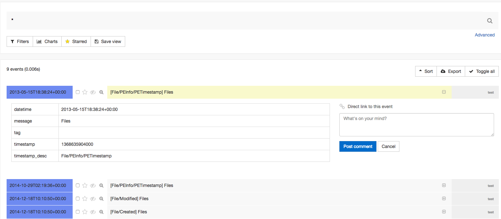

# redline2timesketch
Parses the Redline CSV output in a csv that is importable by timesketch
This is a POC, it is not made to be used in a productive envirenment.

Bugs are expected. This is not meant to be a best practice project how to create python projects but just get things done.

The end goal is to migrate that to timesketch core as a import module similar to csv and json.

## timesketch

To learn about timesketch, visit: [timesketch.org](http://timesketch.org/)

# redline headers
```csv
Alert,Tag,Timestamp,Field,Summary
```

# timesketch headers

```csv
message,timestamp,datetime,timestamp_desc,extra_field_1,extra_field_2
```

# Mapping

```
Alert --> Alert (extra field)
Tag --> Tag (extra field)
Timestamp --> timestamp
Timestamp --> datetime
Field --> timestamp_desc

```

# Usage

Investigate your Host using redline, tag entries or set your filter to trim your results.
Once you are finished, export your results as a csv (make sure to do it from the timeline view, not the tags and comments view)

The result will be an results.csv

Now run redline2timesketch:
```
python2 redline2timesketch.py samples/redline_export.csv.test /timesketch/vagrant/output.csv
Files,1441282883000,2015-09-03T14:21:23+00:00,File/Modified

Files,1441282883000,2015-09-03T14:21:23+00:00,File/Accessed

Files,1441282988000,2015-09-03T14:23:08+00:00,File/Changed

Files,1414545576000,2014-10-29T02:19:36+00:00,File/PEInfo/PETimestamp

Files,1418893850000,2014-12-18T10:10:50+00:00,File/Created

Files,1418893850000,2014-12-18T10:10:50+00:00,File/Modified

Files,1441227082000,2015-09-02T22:51:22+00:00,File/Accessed

Files,1441227102000,2015-09-02T22:51:42+00:00,File/Changed

Files,1368635904000,2013-05-15T18:38:24+00:00,File/PEInfo/PETimestamp

```

The output.csv is ready to be imported to timesketch.

Import it via:

```
vagrant@timesketch-dev:/vagrant$ tsctl csv2ts -n test -f output.csv

Total events: 9
```
That is the result:




# Other tools

https://github.com/bromiley/redsketch
